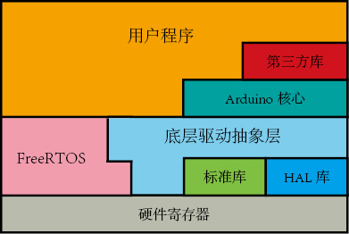
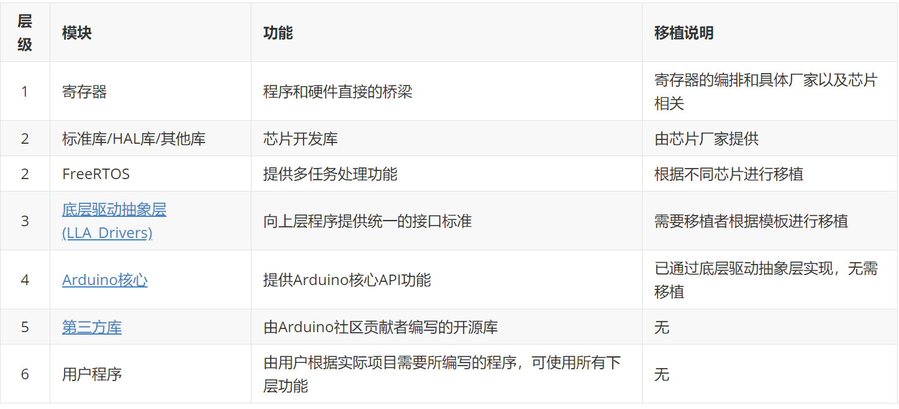

# STM32_ArduinoFrame
## 框架介绍
STM32_ArduinoFrame 框架可以使Arduino 平台编写的应用程序 几部不需做任何更改，就可以在KEIL （目前支持AC5和AC6编译器）完美编译并执行。
注意：Arduino平台的部分第三方库必须使用AC6编译器才能编译通过。因此强烈建议大家抛弃AC5编译器而改用AC6编译器以更好支持C++代码的编译。

## 框架结构

## 各个层级说明

## 第三方库移植说明
使用Arduino 标准API 编写的第三方库或者硬件无关库（例如算法库等抽象库）理论上只需要只需要将其源文件添加进工程中，并在工程 Include Paths 中添加其头文件目录即可使用。若第三方库直接使用寄存器级别代码编写，则需要根据所使用的硬件进行修改。

