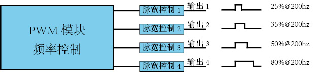

# LLA_PWM模块


>pwm由pwm模块生成一个统一的pwm基础频率，通过每个功能引脚的脉宽控制。可独立控制引脚占空比（不可单独控制频率）。

[toc]

### 1. API一览
|序号|函数原型|作用|
|:--:|--|--|
|1|`void LLA_PWM_BaseHZ(uint32_t hz)`|设置PWM频率|
|2|`void LLA_PWM_Output1(BaseIO_name_t name,uint8_t duty,PWM_Polar_t polar)`|PWM输出方式一|
|3|`void LLA_PWM_OutPut2(BaseIO_name_t name,uint32_t hz,uint8_t duty,PWM_Polar_t polar)`|PWM输出方式二|
|4|`void LLA_PWM_Stop(BaseIO_name_t name)`|停止PWM输出|

### 2. 类型介绍
#### 2.1 PWM_Polar_t（PWM极性）
```cpp
typedef enum{
	PWM_Polar_HIGH,//PWM极性高电平
	PWM_Polar_LOW,//PWM极性低电平
	
	_PWM_POLAR_MAX
}PWM_Polar_t;
```

### 3. 函数介绍

#### 3.1 LLA_PWM_BaseHZ （设置PWM频率）
函数原型`void LLA_PWM_BaseHZ(uint32_t hz)`

输入参数：1
`uint32_t hz`设置PWM模块频率

返回值：无

##### 例程
```cpp
LLA_PWM_BaseHZ(1000);//设置pwm模块频率为 1KHz
```

#### 3.2 LLA_PWM_Output1 （PWM输出方式一）
函数原型`void LLA_PWM_Output1(BaseIO_name_t name,uint8_t duty,PWM_Polar_t polar)`

输入参数：3
`BaseIO_name_t name`pwm输出引脚名称
`uint8_t duty`占空比，`[0,255]`表示0~100%的占空比。
`PWM_Polar_t polar`输出极性

返回值：无

##### 例程
```cpp
LLA_PWM_BaseHZ(1000);//设置pwm模块频率为 1KHz
LLA_PWM_Output1(PA4,64,PWM_Polar_HIGH);//输出高电平占空比25%，频率为1Khz的PWM波形
```

#### 3.3 LLA_PWM_OutPut2 （PWM输出方式二）
函数原型`void LLA_PWM_OutPut2(BaseIO_name_t name,uint32_t hz,uint8_t duty,PWM_Polar_t polar)`

输入参数：4
`BaseIO_name_t name`pwm输出引脚名称
`uint32_t hz`pwm模块频率
`uint8_t duty`占空比，`[0,255]`表示0~100%的占空比。
`PWM_Polar_t polar`输出极性

返回值：无

##### 例程
```cpp
LLA_PWM_Output2(PA4,1000,64,PWM_Polar_HIGH);//输出高电平占空比25%，频率为1Khz的PWM波形
```

#### 3.4 LLA_PWM_Stop （停止PWM输出）
函数原型`void LLA_PWM_Stop(BaseIO_name_t name)`

输入参数：1
`BaseIO_name_t name`pwm输出引脚名称

返回值：无

##### 例程
```cpp
LLA_PWM_Output2(PA4,1000,64,PWM_Polar_HIGH);//输出高电平占空比25%，频率为1Khz的PWM波形
LLA_PWM_Stop(PA4);//停止PA4引脚的PWM输出
```